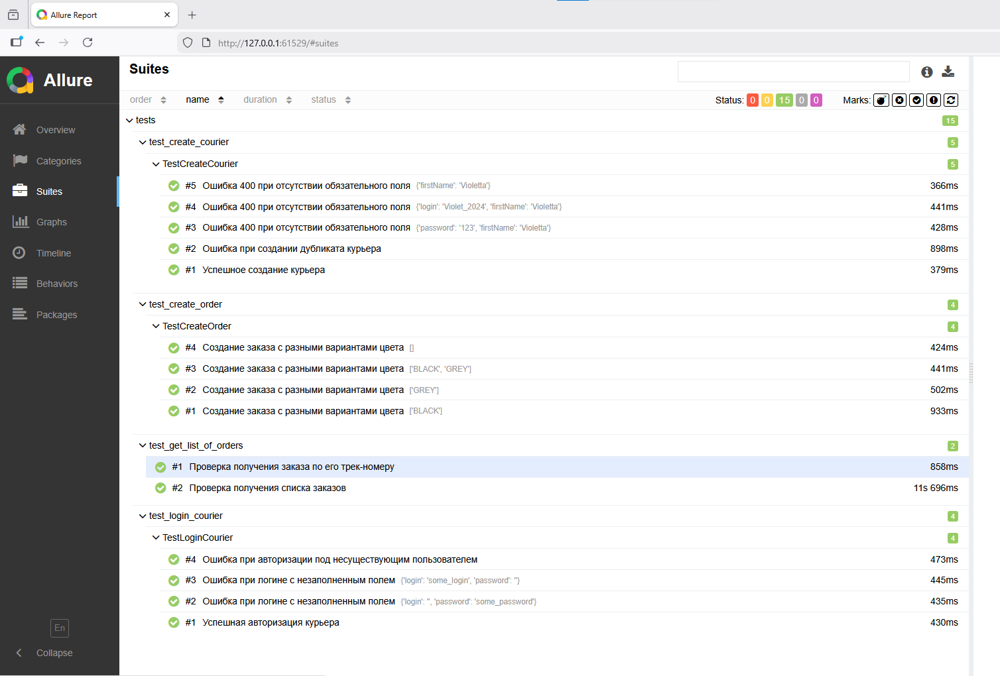

# Финальный проект 7-го спринта: Автотесты API Яндекс Самокат

Репозиторий содержит пакет автоматизированных тестов для учебного сервиса **Яндекс Самокат**. Тестирование выполнено на языке **Python** с использованием библиотек **Pytest** и **Requests**, отчетность реализована через фреймворк **Allure**.

## 🛠 Технологический стек

*   **Python 3.10+** — язык программирования.
*   **Pytest** — фреймворк для написания и запуска тестов.
*   **Requests** — библиотека для работы с HTTP-запросами к API.
*   **Allure** — инструмент для генерации наглядных отчетов о тестировании.

## 📂 Структура проекта

Проект организован по модульному принципу для удобства поддержки:

*   `tests/` — директория с тестовыми модулями:
    *   `test_create_courier.py` — создание курьера (позитивные и негативные сценарии).
    *   `test_login_courier.py` — авторизация курьера в системе.
    *   `test_create_order.py` — параметризованные тесты на создание заказа с разными цветами.
    *   `test_get_list_of_orders.py` — получение списка заказов и проверка получения заказа по треку.
*   `data.py` — статические тестовые данные (класс `TestData`).
*   `urls.py` — базовый URL и эндпоинты API (класс `Urls`).
*   `helpers.py` — вспомогательные методы (включая регистрацию нового курьера).
*   `requirements.txt` — список зависимостей проекта.
*   `.gitignore` — исключение системных и временных файлов из репозитория.

## 🚀 Инструкция по запуску

### 1. Подготовка окружения

Склонируйте репозиторий и создайте виртуальное окружение:

python -m venv venv
# Активация для Windows:
.\venv\Scripts\Activate.ps1

#### 2. Установка зависимостей

Установите все необходимые библиотеки из файла requirements.txt:
pip install -r requirements.txt

#### 3. Запуск тестов

Для запуска всех тестов и сбора данных для формирования Allure-отчета выполните команду:
pytest --alluredir=allure_results

#### 4. Отчетность Allure

Для генерации и автоматического открытия интерактивного отчета в браузере используйте команду:
allure serve allure_results

### Результаты успешного прохождения тестов:

